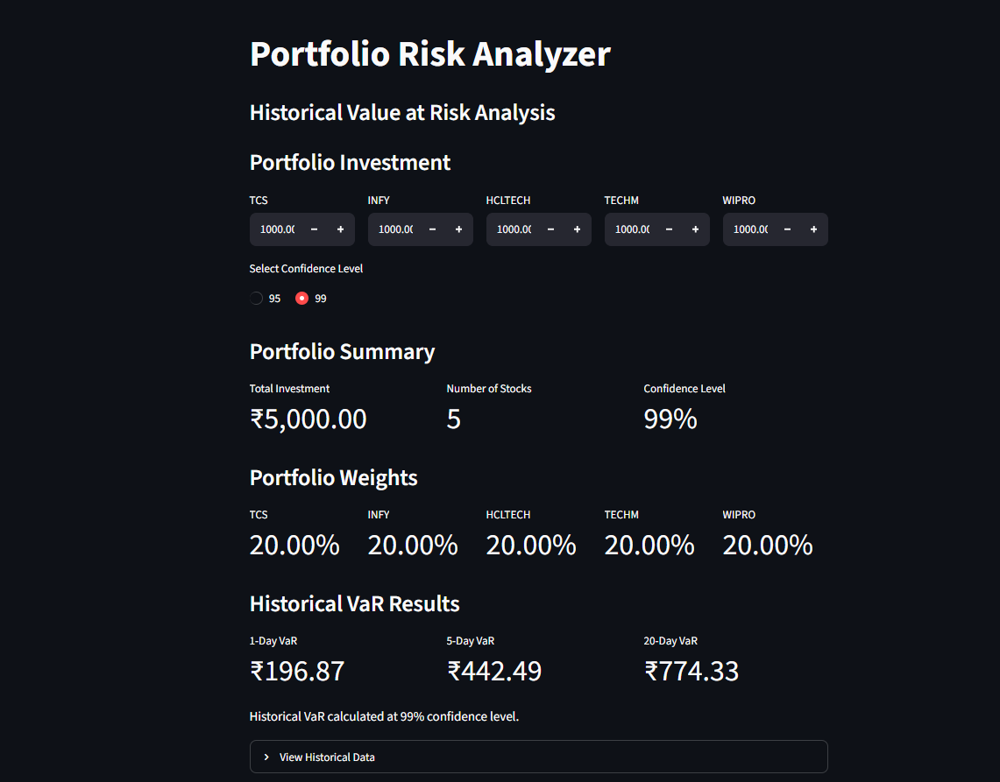

# Portfolio Risk Analyzer

🚀 **Live Demo:** https://portfolio-risk-analyzer-mjxsgkcyyqdoibt2n5yvmv.streamlit.app/

A Streamlit-based portfolio risk analysis application that calculates **Historical Value at Risk (VaR)** for an equally or custom-weighted portfolio of major Indian IT stocks.

## Application Preview



## Project Overview

This project analyzes the potential downside risk of a portfolio using the **Historical Simulation approach to Value at Risk**.

The application allows users to:

- Enter investment amounts for individual stocks
- Automatically calculate portfolio weights
- Select a 95% or 99% confidence level
- Calculate Historical VaR for:
  - 1-Day horizon
  - 5-Day horizon
  - 20-Day horizon
- View the underlying historical dataset

## Stocks Covered

The current portfolio consists of:

- Tata Consultancy Services (TCS)
- Infosys (INFY)
- HCL Technologies (HCLTECH)
- Tech Mahindra (TECHM)
- Wipro (WIPRO)

## Methodology

The application follows a Historical VaR methodology.

### 1. Portfolio Weights

Each stock's portfolio weight is calculated as:

Weight = Investment in Stock / Total Portfolio Investment

### 2. Portfolio Return

The portfolio return is calculated using the weighted sum of individual stock returns:

Portfolio Return = Σ (Weight × Stock Return)

This is calculated separately for the 1-day, 5-day, and 20-day return horizons.

### 3. Portfolio P&L

Historical portfolio P&L is calculated as:

Portfolio P&L = Portfolio Return × Total Investment

### 4. Historical VaR

For a selected confidence level:

VaR = Absolute value of the corresponding lower-tail percentile of historical portfolio P&L.

For example:

- 95% confidence → 5th percentile
- 99% confidence → 1st percentile

The model reports VaR as a potential monetary loss over the selected time horizon.

## Technology Stack

- Python
- Pandas
- OpenPyXL
- Streamlit

## Project Structure

```text
VaR Project/
│
├── app.py
├── var_calculation.py
├── requirements.txt
├── README.md
├── .gitignore
│
└── data/
    └── portfolio_data.xlsx